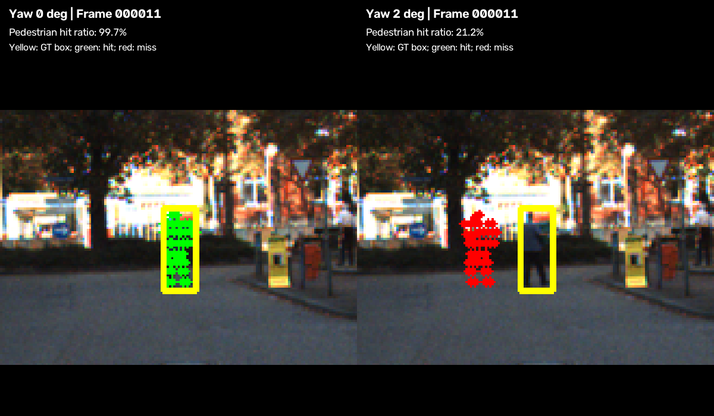

# Báo cáo Day 6: Độ nhạy projection LiDAR–camera với yaw

- **Họ tên:** Nguyễn Hồng Cường
- **MSSV:** 2A202602415
- **Lớp:** AI20K-T4
- **Link repo:** https://github.com/hongcuong26-debug/NguyenHongCuong-2A202602415-Track4-Day21
- **Topic:** A — LiDAR-camera projection QA
- **Dataset:** data/synthetic, data/kitti_mini
- **Các frame đã dùng:** KITTI 000008, 000011, 000049; synthetic 000000–000004 (health), 000000 (projection test)

Môi trường chạy: Windows, Python 3.12.14; NumPy 2.5.3, OpenCV 5.0.0, Pandas 3.0.6, Matplotlib 3.11.2. CP0: KITTI 80/80 và nuScenes 173/173 file PASS; synthetic health đủ 5 frame, khoảng 0.10% điểm invalid/frame. Không sửa data. [Phiên bản dependencies](../results/requirements-lock.txt).

## 1. Claim

Claim cuối: **Trong ba frame KITTI đã chọn, yaw +1° làm hit_ratio frame 000011 giảm 29.38 điểm phần trăm (99.45% → 70.07%), còn frame 000008 giảm 2.54 điểm (99.63% → 97.09%).** Claim nháp “frame nhiều người đi bộ giảm ít nhất 20 điểm, frame đông xe giảm dưới 5 điểm” được xác nhận trong phạm vi mẫu này; không phải kết luận cho mọi cảnh giao thông.

Biến độc lập: `yaw_deg = 0, 0.5, 1, 2, 3` độ quanh trục z-up của LiDAR. Giữ nguyên dataset KITTI, ba frame 000008/000011/000049, labels, classes Car/Van/Pedestrian/Cyclist, toàn bộ range và code metric. Mỗi cấu hình chỉ thay yaw; không dùng ngẫu nhiên.
Metric chính: `hit_ratio = hits / object_points`, đếm cặp điểm–object thuộc box 3D bằng calibration gốc, finite và trong FOV camera gốc (z > 0.1 m). Mẫu số cố định; điểm ra ngoài ảnh sau perturb là miss. Metric phụ: n_points, inside_image, object_points và tỷ lệ theo class. Class vắng hoặc không có điểm ghi NaN.

## 2. Evidence

CSV: [theo frame](../results/yaw_perturb_sweep.csv), [theo frame/class](../results/yaw_perturb_by_class.csv). 15 cấu hình và 60 dòng class; cả hai CSV chạy lần hai giống byte-for-byte, file kiểm tra đã xoá. Hai test metric và bốn test projection PASS.

| Yaw (độ) | 000008: hit (%) | 000011: hit (%) | 000049: hit (%) |
|---|---:|---:|---:|
| 0 | 99.63 | 99.45 | 99.25 |
| 0.5 | 98.83 | 87.45 | 97.50 |
| 1 | 97.09 | 70.07 | 93.37 |
| 2 | 91.85 | 37.10 | 83.89 |
| 3 | 86.66 | 15.72 | 72.81 |


- Yaw 1° làm frame người đi bộ 000011 giảm 29.38 điểm phần trăm, so với 2.54 điểm ở frame đông xe 000008. Mẫu số lần lượt 725 và 5127 cặp điểm–object; frame 000049 có 4557.
- Gộp theo số cặp điểm–object (không lấy trung bình tỷ lệ frame), Pedestrian giảm 96.72% → 78.56% ở 1° (18.16 điểm), Car 99.76% → 95.44% (4.31 điểm), Van 100% → 91.47% (8.53 điểm). Dữ liệu ủng hộ Pedestrian nhạy hơn Car/Van trong mẫu này; Cyclist không xuất hiện, ghi NaN và không vẽ đường giả bằng 0.
- Ở 000011 yaw 2°, inside_image tăng 19946 → 19963 nhưng hit_ratio giảm 99.45% → 37.10%: FOV không đo đúng alignment. Baseline tổng không đạt 100% phù hợp với việc nhãn 2D/3D do người gán không khớp tuyệt đối; occlusion/truncation cũng ảnh hưởng. Chưa suy rộng kết quả ra dataset/sensor khác.

## 3. Failure case



Trường hợp: frame 000011, yaw +2°; ảnh phóng cùng vùng pedestrian ở hai cấu hình, box GT vàng, hit xanh, miss đỏ. Tỷ lệ ghi trên ảnh là toàn bộ class Pedestrian trong frame, không chỉ object được phóng. Pedestrian có 307 cặp điểm–object: baseline 306 hit (99.67%), yaw 2° còn 65 hit (21.17%), giảm 78.50 điểm phần trăm. Tỷ lệ tổng frame giảm 62.34 điểm.

Nguyên nhân/lớp debug: **Geometry — extrinsic calibration drift**; điểm và labels giữ nguyên, chỉ extrinsic bị xoay trong LiDAR frame. Gần tâm ảnh, độ trượt xấp xỉ `f*tan(theta)`; P2 của frame có f = 721.5377 px, theta = 2° cho 25.1967 px. Script đo độ trượt ngang trung vị của các điểm thuộc pedestrian được đánh dấu là −25.4432 px (dọc +0.2618 px). Box này rộng 15.33 px, z = 34.08 m, nên độ lệch vượt bề rộng box; các pedestrian khác rộng 27.67–59.74 px. Xấp xỉ không mô tả chính xác mọi vị trí ảnh do góc nhìn và phép ghép extrinsic.

Cách phát hiện: so tỷ lệ hit theo class với baseline đã QA, đồng thời xem overlay, kiểm tra timestamp rồi calibration version. Trong hai frame có Pedestrian, baseline thấp nhất 95.5322%, còn yaw 0.5° cao nhất 91.3272%; trung điểm là **93.4297%**, chọn ngưỡng thăm dò 93.43% để phân tách hai nhóm đã đo. Đây là ngưỡng từ mẫu nhỏ, chưa được kiểm định độc lập hoặc theo thời gian; cần hiệu chuẩn lại theo distance, occlusion và sensor. Cảnh báo khi tỷ lệ dưới ngưỡng trong nhiều frame liên tiếp đủ điểm; class không có điểm là NaN, không kích cảnh báo. Ba frame rời rạc chưa chứng minh tỷ lệ báo động giả hay hiệu quả cảnh báo theo chuỗi.

## 4. Khuyến nghị nếu triển khai thật

Use-case: xe giao hàng tự hành hoặc ADAS đô thị; theo dõi hit_ratio riêng Pedestrian/Car/Van/Cyclist để phát hiện bracket bị lệch sau va chạm. Không dùng inside_image làm metric calibration chính: nó tăng nhẹ ngay cả khi alignment suy giảm nghiêm trọng trong thí nghiệm.

Ngưỡng thăm dò Pedestrian 93.43% ở mục 3 chỉ là điểm xuất phát. Cảnh báo khi thấp hơn ngưỡng trong nhiều frame liên tiếp đủ điểm, đối chiếu camera/LiDAR time sync rồi yêu cầu QA hoặc recalibration. Ghi log timestamp, frame ID, class, distance, hit_ratio, số điểm, calibration version, nhiệt độ/va chạm nếu có. Nhãn GT của lab không có sẵn khi xe chạy; triển khai cần box/detection đã QA hoặc edge-alignment và phải đo thêm sai số detector, domain shift, occlusion.

Tính membership một lần và dùng lại giúp giảm chi phí; xử lý đủ điểm/overlay mỗi frame tốn tài nguyên, có thể lấy mẫu để giám sát nhưng cần đo độ trễ và nguy cơ bỏ sót drift. Chưa đo latency nên không tuyên bố đạt thời gian thực. Xác nhận ngưỡng và độ dài chuỗi trên log độc lập trước khi nối vào quyết định vận hành.

## 5. Cách chạy lại

Chạy từ thư mục gốc repo. Trên Windows PowerShell, dùng Python 3.12 để tương thích bộ dependencies đã khóa (lần đo dùng 3.12.14); code lab yêu cầu tối thiểu 3.10 nhưng bộ khóa này không cam kết chạy trên 3.10. Môi trường .venv không commit. Nếu máy chỉ có uv, có thể dùng `uv venv --python 3.12 .venv` và `uv pip install --python .venv/Scripts/python.exe -r requirements.txt -r results/requirements-lock.txt` thay bước tạo/cài bên dưới.

```powershell
python -m venv .venv
.\.venv\Scripts\Activate.ps1
python -m pip install -r requirements.txt -r results/requirements-lock.txt
$env:MPLCONFIGDIR = Join-Path $env:TEMP 'day21-matplotlib'
python -c "import numpy, cv2, matplotlib, pandas; print('OK')"
python tools/verify_data.py --data-root data/kitti_mini
python tools/verify_data.py --data-root data/nuscenes_mini_subset
python -m starter.data_health --data-root data/synthetic
python -m src.test_projection
python -m src.test_metric
python -m starter.projection --data-root data/synthetic --frame 000000
python -m starter.projection --data-root data/kitti_mini --frame 000008
python -m starter.projection --data-root data/kitti_mini --frame 000011
python -m starter.projection --data-root data/kitti_mini --frame 000049
python -m src.exp_yaw_sweep --data-root data/kitti_mini --frames 000008 000011 000049 --yaw-levels 0 0.5 1 2 3
python -m src.plot_yaw_sweep
python -m src.make_failure_figure
python -m src.exp_yaw_sweep --out results/check_rerun.csv --class-out results/check_rerun_by_class.csv
python -c "from pathlib import Path; p=Path('results'); pairs=[('yaw_perturb_sweep.csv','check_rerun.csv'),('yaw_perturb_by_class.csv','check_rerun_by_class.csv')]; assert all((p/a).read_bytes()==(p/b).read_bytes() for a,b in pairs); [(p/b).unlink() for a,b in pairs]; print('Byte-for-byte PASS')"
python tools/check_submission.py
git diff --check
git diff -- data/
git status --short
```

macOS/Linux: kích hoạt bằng `source .venv/bin/activate`, đặt `MPLCONFIGDIR` vào thư mục ghi được; các lệnh Python giữ nguyên. Git trên Windows có thể checkout CSV thành CRLF: so byte hai lần chạy mới tạo (script cố định LF), so nội dung/số liệu với bản checkout. Mọi CLI trong src hỗ trợ `--help`.

Giải thích để vấn đáp: thêm cột 1 vào (x,y,z) để ma trận 4×4 áp dụng cả rotation lẫn translation; chuỗi là P2·R0_rect·Tr_velo_to_cam. Lọc z_cam ≤ 0 vì điểm sau camera có thể chiếu ngược lên ảnh, và lọc z ≤ 0.1 m để tránh vùng gần kỳ dị. `points_in_box` trừ bottom center rồi nhân nghịch đảo rotation_y, kiểm tra x ∈ [−l/2,l/2], y ∈ [−h,0], z ∈ [−w/2,w/2]. Hit là điểm trong box 3D gốc sau projection vẫn nằm trong bbox 2D tương ứng; box chồng lấp có thể đếm một điểm cho nhiều object. Pedestrian hẹp nên cùng độ trượt pixel mất tỷ lệ hit lớn hơn; FOV chỉ kiểm tra điểm còn nằm trong ảnh, không kiểm tra chúng khớp đúng object.

## 6. Khai báo sử dụng AI

| Công cụ | Dùng cho việc gì | Bạn đã kiểm chứng thế nào |
|---|---|---|
| Codex / ChatGPT | Khảo sát repo, lập kế hoạch, hỗ trợ viết hai hàm projection, tests, benchmark, class analysis, biểu đồ, ảnh failure và REPORT | Codex đã thực thi 4 test projection + 2 test metric, đối chiếu điểm (10,0,0), chạy lại CSV giống từng byte, xem overlay/plot/failure và chạy check_submission. Học viên cần tự chạy lại và giải thích code/số liệu trước vấn đáp. |
| Tài liệu và starter của lab Day 6 (không phải AI) | Quy ước KITTI, load_frame, perturb_extrinsic, demo overlay và mốc kiểm tra | Chỉ sửa hai hàm cho phép; toàn bộ benchmark mở rộng theo class trong src viết cho bài này. |
