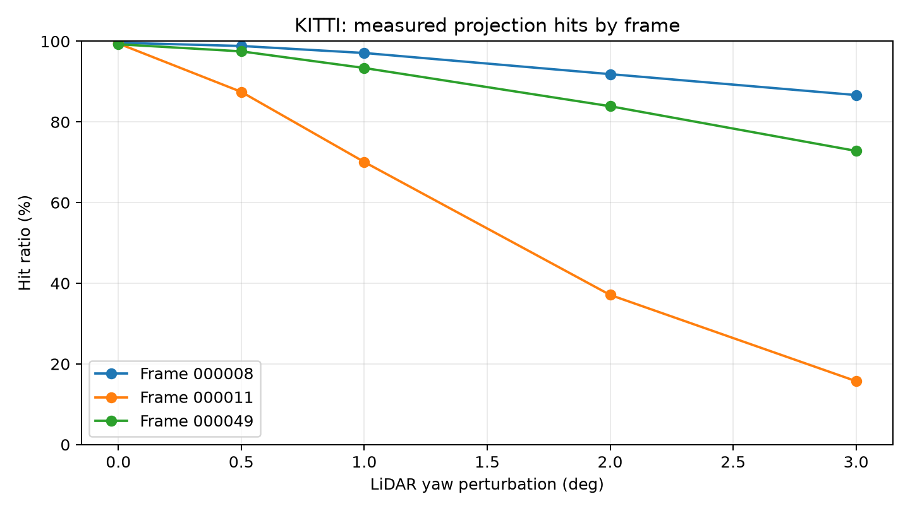
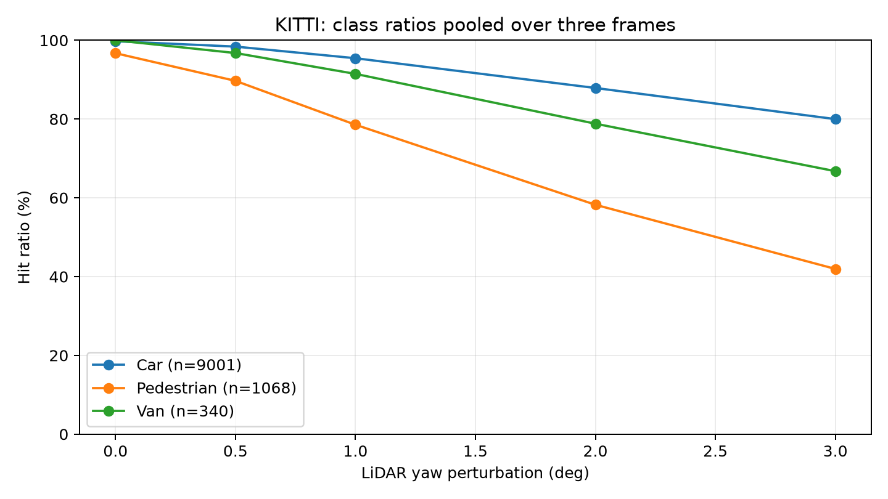

# Báo cáo Day 6: [ĐIỀN tên đề tài ngắn]

> Thay **mọi** ô có chữ ĐIỀN nằm trong ngoặc vuông bằng nội dung của bạn, xoá luôn cả dấu ngoặc vuông. Lệnh `python tools/check_submission.py` sẽ báo FAIL nếu còn sót bất kỳ chỗ nào.

- **Họ tên:** Nguyễn Hồng Cường
- **MSSV:** 2A202602415
- **Lớp:** AI20K-T4
- **Link repo:** https://github.com/hongcuong26-debug/NguyenHongCuong-2A202602415-Track4-Day21
- **Topic:** A — LiDAR-camera projection QA
- **Dataset:** data/synthetic, data/kitti_mini
- **Các frame đã dùng:** KITTI 000008, 000011, 000049; synthetic 000000–000004 (health), 000000 (projection test)

> Hãy viết ngắn: mỗi mục từ 3 đến 8 dòng, ưu tiên số liệu và hình ảnh.

## 1. Claim

Claim nháp, chưa phải kết luận: “Lệch yaw 1° làm hit_ratio của frame có nhiều người đi bộ giảm ít nhất 20 điểm phần trăm so với calibration gốc, trong khi frame đông xe giảm dưới 5 điểm phần trăm.”

Biến độc lập: `yaw_deg = 0, 0.5, 1, 2, 3` độ quanh trục z-up của LiDAR. Giữ nguyên dataset KITTI, ba frame 000008/000011/000049, labels, classes Car/Van/Pedestrian/Cyclist, toàn bộ range và code metric. Mỗi cấu hình chỉ thay yaw; không dùng ngẫu nhiên.
Metric chính: `hit_ratio = hits / object_points`, đếm cặp điểm–object thuộc box 3D bằng calibration gốc, finite và trong FOV camera gốc (z > 0.1 m). Mẫu số cố định; điểm ra ngoài ảnh sau perturb là miss. Metric phụ: n_points, inside_image, object_points và tỷ lệ theo class. Class vắng hoặc không có điểm ghi NaN.

## 2. Evidence

CSV: [theo frame](../results/yaw_perturb_sweep.csv), [theo frame/class](../results/yaw_perturb_by_class.csv). 15 cấu hình và 60 dòng class; cả hai CSV chạy lần hai giống byte-for-byte, file kiểm tra đã xoá. Hai test metric và bốn test projection PASS.

| Yaw (độ) | 000008: hit (%) | 000011: hit (%) | 000049: hit (%) |
|---|---:|---:|---:|
| 0 | 99.63 | 99.45 | 99.25 |
| 0.5 | 98.83 | 87.45 | 97.50 |
| 1 | 97.09 | 70.07 | 93.37 |
| 2 | 91.85 | 37.10 | 83.89 |
| 3 | 86.66 | 15.72 | 72.81 |





- Yaw 1° làm frame người đi bộ 000011 giảm 29.38 điểm phần trăm, so với 2.54 điểm ở frame đông xe 000008. Mẫu số lần lượt 725 và 5127 cặp điểm–object; frame 000049 có 4557.
- Gộp theo số cặp điểm–object (không lấy trung bình tỷ lệ frame), Pedestrian giảm 96.72% → 78.56% ở 1° (18.16 điểm), Car 99.76% → 95.44% (4.31 điểm), Van 100% → 91.47% (8.53 điểm). Dữ liệu ủng hộ Pedestrian nhạy hơn Car/Van trong mẫu này; Cyclist không xuất hiện, ghi NaN và không vẽ đường giả bằng 0.
- Ở 000011 yaw 2°, inside_image tăng 19946 → 19963 nhưng hit_ratio giảm 99.45% → 37.10%: FOV không đo đúng alignment. Baseline tổng không đạt 100% phù hợp với việc nhãn 2D/3D do người gán không khớp tuyệt đối; occlusion/truncation cũng ảnh hưởng. Chưa suy rộng kết quả ra dataset/sensor khác.

## 3. Failure case

Nêu khi nào hệ thống hoặc phương pháp fail, vì sao fail, và liên hệ tới lớp nào trong 6 lớp debug: I/O, Geometry, Time, Preprocess, Model, Metric.


[ĐIỀN]

## 4. Khuyến nghị nếu triển khai thật

Use-case cụ thể (ADAS / robot / drone), trade-off và bước tiếp theo.

[ĐIỀN]

## 5. Cách chạy lại

Các lệnh tái tạo lại toàn bộ kết quả từ repo sạch.

```bash
[ĐIỀN]
```

## 6. Khai báo sử dụng AI

Ghi rõ đã dùng công cụ AI nào, dùng vào việc gì, và bạn đã tự kiểm chứng kết quả đó bằng cách nào. Nếu không dùng AI, ghi "Không sử dụng". Xem quy định ở `RULES.md` mục 2.

| Công cụ | Dùng cho việc gì | Bạn đã kiểm chứng thế nào |
|---|---|---|
| [ĐIỀN] | | |
